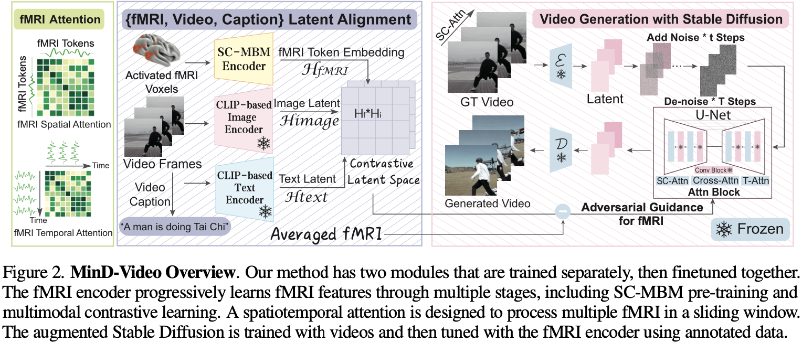
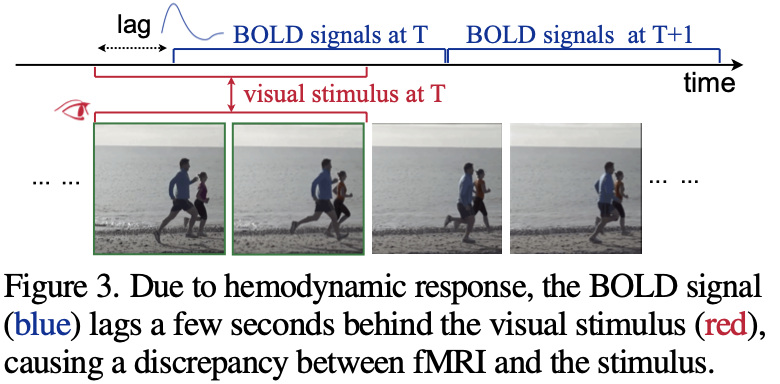
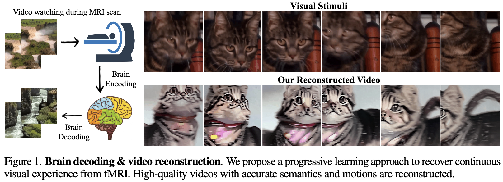
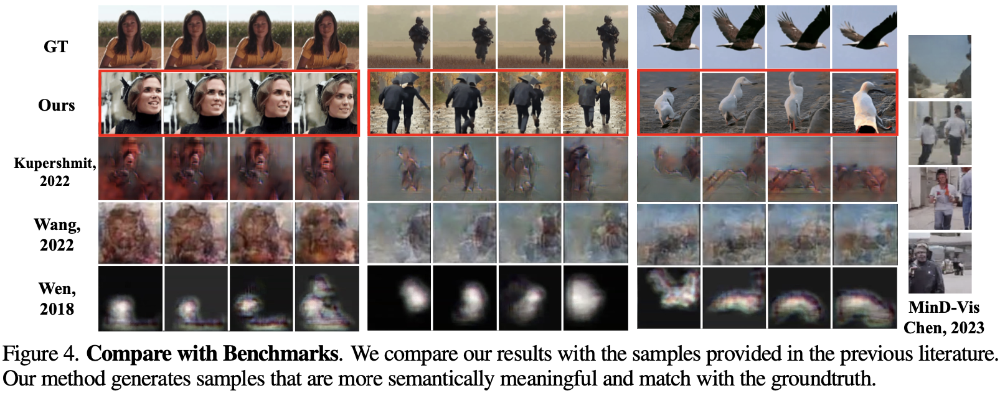
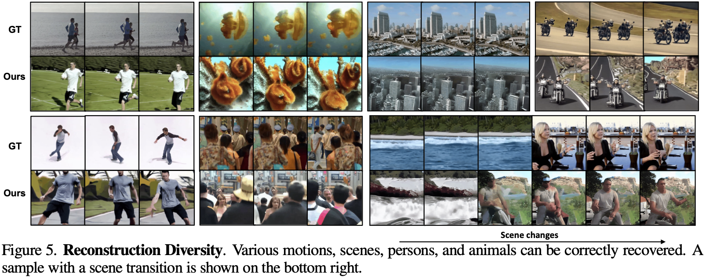
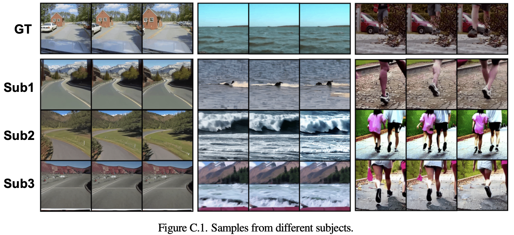

# [论文笔记] 开山鼻祖? 🧠 Mind-Video: 视频刺激人脑响应解码 🐱

Author: <a href="https://yusijin02.github.io/">Sijin Yu</a>

> **标题**: Cinematic Mindscapes: High-quality Video Reconstruction from Brain Activity
> **作者**: Zijiao Chen, Jiaxin Qing, Juan Helen Zhou
> **会议**: NIPS 2023 (*Oral*)
> **HomePage**: https://www.mind-video.com/
> **arXiv**: https://arxiv.org/abs/2305.11675
> **GitHub**: https://github.com/jqin4749/MindVideo

[TOC]

## 0. Abstract

- 重建人类从大脑活动中的视觉一直是一个吸引人的任务, 有助于我们理解我们的认知过程.
- 尽管最近的研究在从非侵入性脑记录中重建静态图像方面取得了巨大成功, 但在以视频形式恢复连续视觉体验的工作仍然有限.
- 在这项工作中, 我们提出了 MinD-Video, 它通过**掩码脑建模 (masked brain modeling)**、具有**时空注意力 (spatiotemporal attention)** 的多模态对比学习, 以及与结合了**网络时间膨胀 (network temporal inflation)** 的**增强稳定扩散模型 (augmented Stable Diffusion model)** 的共同训练，逐步从连续的大脑皮层功能磁共振成像 (fMRI) 数据中学习时空信息.
- 我们展示了 MinD-Video 可以使用**对抗性 (adversarial)** 指导重建任意帧率的高质量视频.
- 恢复的视频通过各种语义和像素级指标进行了评估.
- 我们在语义分类任务中实现了平均 85% 的准确率, 并在结构相似性指数 (structural similarity index, SSIM) 中达到了 0.19, 比之前的最先进水平高出 45%.
- 我们还展示了我们的模型在生物学上是可行和可解释的, 反映了已建立的生理过程.

## 2. Motivation & Contribution

### 2.1 Motivation

- 作者希望通过大脑记录重建人类视觉来理解认知过程.
- 作者希望克服非侵入性方法如功能性磁共振成像 (fMRI) 的限制, 这些方法捕获的信息有限且受噪声影响.
- 作者希望解决从 fMRI 数据重建动态视觉体验的复杂性, 超越静态图像.
- 作者希望解码 fMRI 来恢复高帧率视频, 这是一个挑战, 因为 fMRI 的时间分辨率较低.
- 作者希望改进补偿 BOLD 信号中血液动力学响应 (HR) 延迟的次优方法.

### 2.2 Contribution

- 开发了 MinD-Video, 一种连接图像和视频大脑解码差距的双模块流程.
- 实现了 fMRI 编码器的渐进学习, 包括具有时空注意力的多模态对比学习.

- 为基于 fMRI 指导的视频生成增强了稳定扩散模型, 具有接近帧的注意力能力.
- 实现了高质量的视频重建, 具有超越现有最先进技术 45% 的语义和像素级精度.
- 通过注意力分析显示与视觉皮层和更高认知网络的映射, 证明了模型在生物学上是可行和可解释的.

## 3. Model

MinD-Video 由两个模块组成: 一个 fMRI encoder, 一个 video generative model. 两个模块分开训练并一起微调.

- **fMRI encoder**: 将 fMRI 信号转换为 embedding, 并且应具有以下两个特征:

  (1) 应该包含有关扫描期间呈现的视觉刺激的丰富而紧凑的信息,

  (2) 应该接近视频生成模型训练的嵌入域.

- **video generative model**: 以 fMRI 信号的 embedding 为条件, 生成视频.

### 3.1 fMRI encoder

#### 3.1.1 fMRI 数据的预处理

**如何定义 ROIs?** 

- 使用预定义好的脑区模板.
- 依靠统计测试来识别刺激期间激活的体素. (计算每个体素的内部受试者再现性, 通过多次观看的 fMRI 数据进行相关性分析. 相关系数转换为 z 分数并取平均. 我们使用单样本 t 检验计算统计显著性, 其中 P < 0.01, 自由度=17, Bonferroni 校正. 在统计测试后选择了最显著的前 50% 体素. 大多数被识别的体素来自视觉皮层)

#### 3.1.2 MBM 预训练

- MBM: masked brain modeling.

- 使用基于 ViT 的 autoencoder, 在 HCP 1200 subjects 上做预训练. 
- 这里的目的是拿到一个 fMRI encoder, 它可以很好地从原始 fMRI 数据中提取 embedding.

#### 3.1.3 滑窗 fMRI 的时空注意力

血液动力学信号相对于视频刺激有一定的拖后, 如下图所示.

- 令时间点 $t$ 的 fMRI 的 token embedding 为 $x_t\in\mathbb R^{n\times p\times b}$. 这里, $n$ 是 batch size. $p$ 是 patch size, $b$ 是 embdding dim.

- 一个固定的 fMRI 滑窗 (大小为 $w$) 定义为: $\mathbf x_t=\{x_t, x_{t+1}, \cdots,x_{t+w-1}\}$. 因此 $\mathbf x_t\in \mathbb R^{n\times w\times p\times b}$.

- 计算**空间注意力**:

  - 将 $\mathbf x_t$ 的前两个维度 merge, 得到 $\mathbf x_t^{\text{spat}}\in\mathbb R^{nw\times p\times b}$.

  - 计算 query $Q$, key $K$ 和 value $V$. ($W_{\text{spat}}^Q, W_{\text{spat}}^K, W_{\text{spat}}^V\in\mathbb R^{b\times b}$)

    - $Q=\mathbf x_t^{\text{spat}}\cdot W_{\text{spat}}^Q\in\mathbb R^{nw\times p\times b}$ 

    - $K=\mathbf x_t^{\text{spat}}\cdot W_{\text{spat}}^K \in\mathbb R^{nw\times p\times b}$

    - $V=\mathbf x_t^{\text{spat}}\cdot W_{\text{spat}}^V \in\mathbb R^{nw\times p\times b}$ 

  - 计算 attn 矩阵: $\text{attn}= \text{softmax}\left(\frac{QK^T}{\sqrt b}\right)\in\mathbb R^{nw\times p\times p}$.

  - $\mathbf x_t^{\text{spat}}=\text{attn}\cdot \mathbf x_t^{\text{spat}}\in\mathbb R^{nw\times p\times b}$.

- 计算**时间注意力**:

  - 将 $\mathbf x_t$ 的第一和第三维度 merge, 得到 $\mathbf x_t^{\text{temp}}\in\mathbb R^{np\times w\times b}$. 其它处理和空间注意力一致.

#### 3.1.4 多模态对比学习

- 将 fMRI embeddings 往 text-image 的 shared space 拉近. (这是因为生成模型总是以文本为条件预训练)

- 步骤:

  - 将训练集的视频下采样至 3FPS.
  - 每一帧由 BLIP 做 caption. 同一场景的两帧的 caption 很接近, 但是场景转换时不是, 这时用一个 "Then" 对两个 caption 做连接.
  - 然后 CLIP 的 image encoder 和 text encoder 被 frozen. CLIP 的 loss由两部分组成: fMRI 和 image 的相似度, fMRI 和 text 的相似度.

- CLIP Loss: 令 text, image, fMRI 的 embeddings 分别为 $emb_t, emb_i, emb_f\in\mathbb R^{n\times b}$. 则:
  $$
  \mathcal L = \frac{1}{2}\mathcal L_{\text{CLIP}}(emb_f, emb_t)+\frac12\mathcal L_{\text{CLIP}}(emb_f, emb_i)
  $$

### 3.2 Video Generative Module

#### 3.2.1 动态场景稀疏因果注意力

- 令 $z_{v_i}$ 为生成时的第 $i$ 帧. 则计算稀疏因果注意力时, $K, Q, V$ 的计算为:
  - $Q=W^Q\cdot z_{v_i}$.
  - $K=W^K\cdot [z_{v_{i-2}}, z_{v_{i-1}}]$.
  - $V=W^V\cdot [z_{v_{i-2}}, z_{v_{i-1}}]$.

#### 3.2.2 fMRI 的对抗引导

- 令 $c$ 为条件. 在这里它就是 fMRI 的 embedding.

- 令 $\bar c$ 为**负条件**. 在生成模型中, $c$ 引导模型"生成什么", 而 $\bar c$ 引导模型"不要生成什么". 在训练时它是 0, 在推理时它是测试集的 fMRI 信号的平均.

- 令 $s$ 为 guidance scale.

- 令 $\epsilon_{\theta}(\cdot)$ 为 UNet 实现的噪音评估器, 参数为 $\theta$.

- 噪音更新函数为:
  $$
  \hat \epsilon_{\theta}(z_t, c, \bar c)=\epsilon_{\theta}(z_t)+s(\epsilon_{\theta}(z_t, c)-\epsilon_{\theta}(z_t))
  $$

## 4. Experiment

### 4.1 Dataset

- **预训练数据集**: HCP 1200 Subject Release. 使用静息态和任务态 fMRI 数据预训练 MBM.
- **fMRI-Video 对数据集**: 一个公开的 benchmark fMRI-video 数据集, 包括 fMRI 和视频片段. 

### 4.2 Implementation Details

- 将视频从 30 FPS 下采样至 3 FPS 做训练和推理.
- 从一个 fMRI 帧中重构 2 秒的视频 (即 6 帧).
- fMRI encoder: 基于 ViT, patch size = 16, depth =  24, embedding dim = 1024, MBM 的 mask ratio = 0.75. token embdding dim 是 77x768
- 使用了 Stable Diffusion V1-5 (分辨率 512x512), 在 256x256 3 FPS 上微调.
- MBM 的预训练使用了 8 * 3090. 其它阶段使用了 1 * 3090.
- 推理使用 200 DDIM 时间步.

### 4.3 Metrics

- **Frame-based Metrics**: SSIM, N-way top-K accuracy classification.
- **Video-based Metric**: 使用基于 VideoMAE 的 video classifier (在 K400 上训练).

### 4.4 对比实验

### 4.5 消融实验

### 4.6 可解释性实验

- **视觉皮层的主导性**: 视觉皮层成为最有影响力的区域. 这个区域包括中心视觉 (VisCent) 和周围视觉 (VisPeri) 领域, 始终在不同层和训练阶段吸引最高的注意力 (如图B所示)

  但是, **视觉皮层并非视觉的唯一决定因素**. 例如: 自主视觉空间注意力控制的背侧注意网络, 与思考和回忆相关的默认模式网络, 也对视觉感知过程有所贡献.

- **层依赖的层级结构**: 如图CDE所示, (C) **模型的早期层通过注意力值清晰划分不同的脑区**. 当模型深入深层, 其学到的东西变得更分散, 这表明模型学习了更全面和抽象的视觉特征.

- **逐步学习语义**: 为了说明功能性磁共振成像编码器的学习进程，作者分析了所有学习阶段后的第一层注意力, 如B所示. 实验结果显示**在高级认知网络中的注意力增加, 以及视觉皮层的注意力减少**.

### 4.7 一些定性的结果展示

